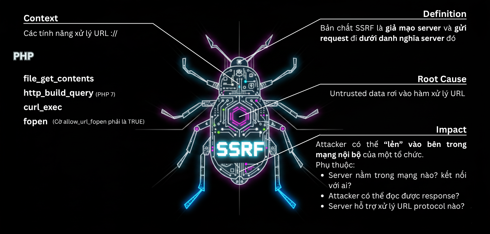

# Server-Side Request Forgery

## 🗺️ Mindmap
- [XMind Link](https://app.xmind.com/share/ILdYYQPJ?xid=vjJWLar1)

## 📌 Useful Reports
[1. Server Side Request Forgery(SSRF) Explained with Examples](https://touhidshaikh.com/blog/2023/01/server-side-request-forgeryssrf-explained-with-examples/#:~:text=An%20attacker%20may%20also%20use%20the%20%E2%80%9Cftp%E2%80%9D%20protocol,of%20the%20%E2%80%9Csensitive-file%E2%80%9D%20on%20the%20internal%20FTP%20server.)

[2. A New Era of SSRF](https://www.blackhat.com/docs/us-17/thursday/us-17-Tsai-A-New-Era-Of-SSRF-Exploiting-URL-Parser-In-Trending-Programming-Languages.pdf)
